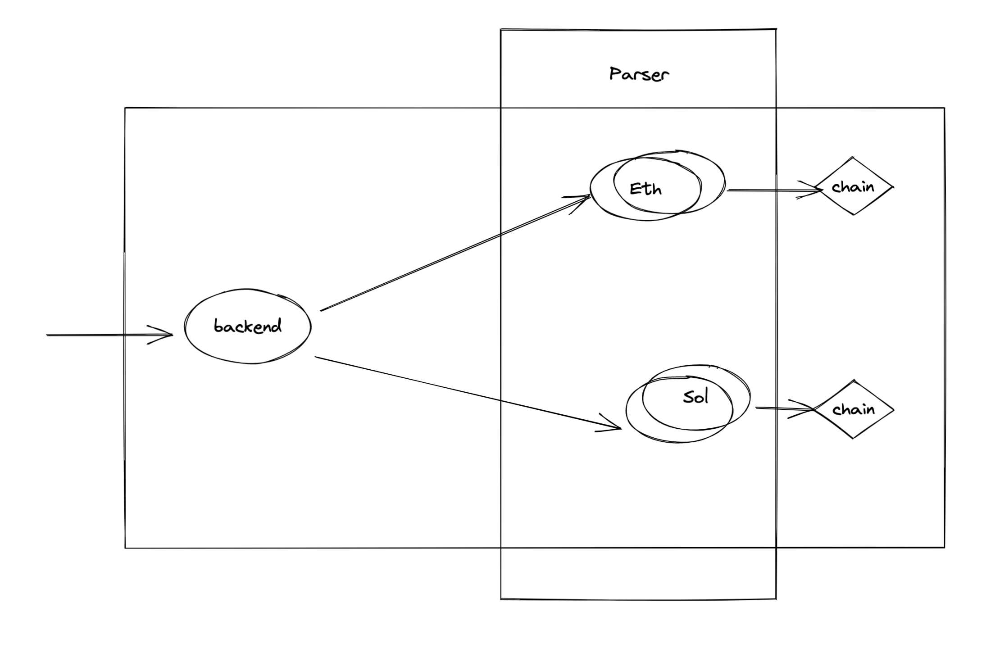
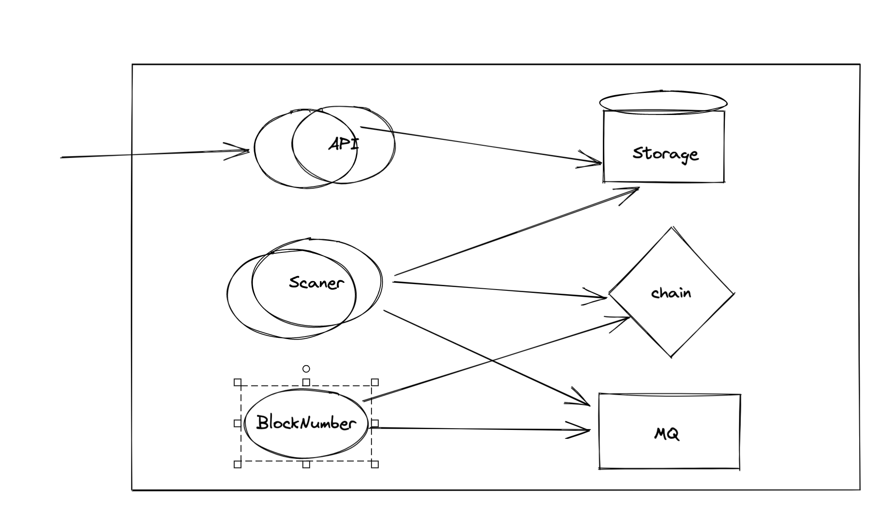

# eth parser

This project implements a parser interface to keep track of eth addresses transations

Here is how it works

1. Compare chain block number and parsed block number and send a todo number to message queue (A message guarantee to process, and it won't lose block )
1. Scaner receive the number and get transcation from the chain, and save to storage.
1. API reads storage and provides data.

API and the scanner must be able to stateless, so they can scale.

## Diagrams






## To start the app

```bash
go run cmd/main.go
```


## Sample requests

Get parsed block

```bash
curl --location --request GET 'http://localhost:8080/block'
```

Subscribe a new address

```bash
curl --location --request POST 'http://localhost:8080/subscribe' \
--header 'Content-Type: application/json' \
--data-raw '{
    "address": "0x161e49d16d5952ddcc38e68b93b02f826138ff4f"
}'
```

Get transactions

```bash
curl --location --request GET 'http://localhost:8080/transactions?address=0x161e49d16d5952ddcc38e68b93b02f826138ff4f'
```
